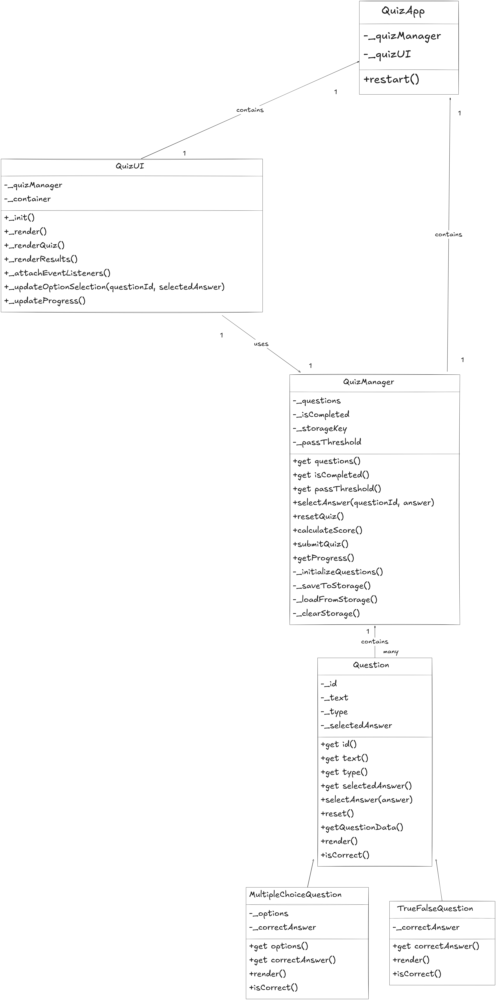

# Quiz App

## 1. System Overview

The Quiz App is a single-page web application (SPA) designed to provide an interactive and engaging quiz experience. Built with modern JavaScript (ES6+), it leverages Object-Oriented Programming (OOP) principles to create a modular, scalable, and maintainable codebase. The application features persistent state management using `localStorage`, ensuring that a user's progress is saved across browser sessions.

## 2. Technical Architecture

The application's architecture is centered around a clear separation of concerns, primarily divided into data/logic management and UI rendering. This is achieved through a set of distinct classes, each with a specific responsibility.

### Core Classes and Object-Oriented Design

#### `Question` (Abstract Base Class)
Serves as the foundational blueprint for all question types, defining a common interface and shared functionality.

*   **Purpose**: To enforce a consistent structure for different question types.
*   **Encapsulation**: Uses private properties with public getters to protect internal state.
*   **Abstract Methods**: `render()` and `isCorrect()` must be implemented by subclasses.
*   **Properties**:
    *   `id`: A unique identifier for the question.
    *   `text`: The question's content.
    *   `type`: The question type (e.g., `multiple-choice`).
    *   `selectedAnswer`: The answer chosen by the user.
*   **Methods**:
    *   `selectAnswer(answer)`: Sets the user's selected answer.
    *   `reset()`: Clears the selected answer.
    *   `getQuestionData()`: Returns a plain object representation of the question's state for storage.

---

#### `MultipleChoiceQuestion` (Inherits from `Question`)
A concrete class for questions that present multiple options.

*   **Polymorphism**: Implements custom `render()` and `isCorrect()` methods suitable for a multiple-choice format.
*   **Properties**:
    *   `options`: An array of answer strings.
    *   `correctAnswer`: The string corresponding to the correct option.

---

#### `TrueFalseQuestion` (Inherits from `Question`)
A concrete class for true or false questions.

*   **Polymorphism**: Implements custom `render()` and `isCorrect()` methods for a binary choice format.
*   **Properties**:
    *   `correctAnswer`: A boolean (`true` or `false`) representing the correct answer.

---

#### `QuizManager` (Composition)
The central controller for all quiz logic, state, and data persistence. It does not interact with the DOM directly.

*   **Purpose**: To manage the quiz lifecycle, including questions, answers, and scoring.
*   **Composition**: Holds an array of `Question` objects.
*   **Properties**:
    *   `questions`: An array of `Question` instances.
    *   `isCompleted`: A flag indicating if the quiz has been submitted.
    *   `passThreshold`: The minimum score required to pass the quiz.
    *   `storageKey`: The key for `localStorage`.
*   **Methods**:
    *   `selectAnswer(questionId, answer)`: Updates the selected answer for a specific question.
    *   `submitQuiz()`: Finalizes the quiz, calculates the score, and marks it as completed.
    *   `calculateScore()`: Determines the user's score based on correct answers.
    *   `resetQuiz()`: Clears all answers and quiz state.
    *   `_saveToStorage()`: Persists the current quiz state to `localStorage`.
    *   `_loadFromStorage()`: Loads the quiz state from `localStorage`.
    *   `_clearStorage()`: Removes quiz data from `localStorage`.

---

#### `QuizUI` (DOM Manipulation)
Responsible for all interactions with the DOM, rendering the user interface, and handling user input.

*   **Purpose**: To decouple application logic from the presentation layer.
*   **Composition**: Holds a reference to a `QuizManager` instance to get the data it needs to render.
*   **Event Handling**: Uses event delegation for efficient event listener management.
*   **Methods**:
    *   `_render()`: The main rendering method that decides whether to show the quiz or the results.
    *   `_renderQuiz()`: Renders the list of questions and options.
    *   `_renderResults()`: Renders the final score and feedback.
    *   `_attachEventListeners()`: Sets up all necessary event listeners for the application.

---

#### `QuizApp` (Application Controller)
The main entry point that initializes and coordinates the different components of the application.

*   **Purpose**: To bootstrap the application.
*   **Composition**: Creates and holds instances of `QuizManager` and `QuizUI`.
*   **Methods**:
    *   `restart()`: Provides a mechanism to completely reset the application to its initial

